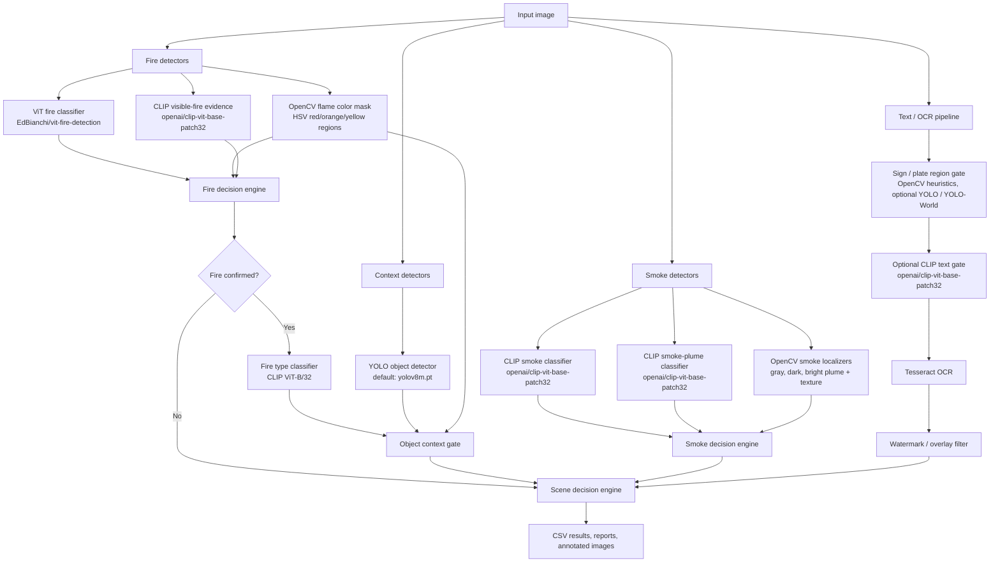

# Fire and Smoke Image Analysis

This repository analyzes image folders for fire, smoke, scene context, and readable sign or plate text. It does not rely on a single detector. Instead, it runs several detectors and then combines their outputs through decision engines.

The important idea is that some detectors are primary classifiers and some detectors are gates or supporting evidence. For example, OpenCV flame color can locate flame-like pixels, but it is not trusted by itself as a final fire decision. Likewise, OpenCV smoke masks can locate smoke-like regions, but CLIP smoke results are used as the stronger smoke classifier unless localizer-only smoke is explicitly allowed.

---

## What the pipeline detects

The pipeline can produce final scene labels such as:

- Fire
- Smoke Only
- Fire + Smoke
- Vehicle Fire
- Structure Fire
- Forest Fire
- Grass Fire
- HazMat Fire
- Container / Trash Fire
- Other Fire
- No Fire / No Smoke
- Uncertain Fire/Smoke Scene

---

## Main execution flow



---

## Detector summary

| Area | Detector name in code | Model / method | Role |
|---|---|---|---|
| Fire | `vit_fire` | `EdBianchi/vit-fire-detection` | Primary fire / no-fire classifier |
| Fire | `opencv_flame` | HSV red/orange/yellow OpenCV mask | Flame localization and support evidence |
| Fire | `clip_fire_evidence` | `openai/clip-vit-base-patch32` | Supporting visible-fire evidence |
| Smoke | `clip_smoke` | `openai/clip-vit-base-patch32` | Primary smoke / no-smoke classifier |
| Smoke | `clip_smoke_plume` | `openai/clip-vit-base-patch32` | Supporting smoke-plume classifier |
| Smoke | `opencv_smoke` | OpenCV gray/white smoke mask | Smoke localization and support evidence |
| Smoke | `opencv_dark_smoke` | OpenCV dark smoke mask | Smoke localization and support evidence |
| Smoke | `opencv_bright_plume` | OpenCV bright plume + texture filter | Smoke localization and support evidence |
| Context | `yolo_objects` | Ultralytics YOLO, default `yolov8m.pt` | Object context: vehicles, people, etc. |
| Text | `ocr_text` | Sign/plate gate + Tesseract OCR | Extracts useful text only from gated regions |
| Text gate | `sign_detector` | OpenCV heuristics, optional `yolov8s-worldv2.pt` or custom YOLO sign model | Finds sign/plate-like regions before OCR |
| Text gate | `clip_text_gate` | `openai/clip-vit-base-patch32` | Optional gate to decide if a crop looks like readable text |
| Fire type | `clip_fire_type` | `openai/clip-vit-base-patch32` | Classifies type of confirmed fire |

---

## How gating works

### Fire gating

Fire decision inputs:

- `vit_fire`
- `opencv_flame`
- `clip_fire_evidence`

Practical behavior:

1. `vit_fire` is the strongest fire classifier.
2. `opencv_flame` finds flame-colored regions, but color alone is not treated as reliable fire confirmation.
3. `clip_fire_evidence` can support a fire result, especially when flame-colored regions are also present.
4. Strong no-fire evidence can suppress weak color-only fire detections.
5. Weak or partial fire evidence becomes `Uncertain` rather than confirmed `Fire`.

### Smoke gating

Smoke decision inputs:

- `clip_smoke`
- `clip_smoke_plume`
- `opencv_smoke`
- `opencv_dark_smoke`
- `opencv_bright_plume`

Practical behavior:

1. `clip_smoke` is the primary smoke classifier.
2. `clip_smoke_plume` is supporting evidence.
3. OpenCV smoke detectors provide region evidence, not a final decision by themselves under the default configuration.
4. Strong `No Smoke` from the primary CLIP smoke classifier can veto weak localizer hits.
5. OpenCV-only smoke normally becomes `Uncertain Smoke` unless `--allow-opencv-smoke-alone` is used.

### OCR gating

OCR is not run freely across the whole image by default.

1. `sign_detector` first searches for likely sign or plate regions.
2. If enabled, `clip_text_gate` checks whether the crop appears to contain readable sign/plate text.
3. Tesseract OCR runs on approved crops.
4. Watermark and overlay text are filtered from the final output.

### Fire type gating

Fire type classification only runs after fire is confirmed.

1. `clip_fire_type` predicts a fire category.
2. YOLO object context can refine or override the category.
3. If a vehicle object is near or overlapping the flame region, the scene can be classified as `Vehicle Fire`.

---

## Install

### 1. Create and activate a virtual environment

Windows Command Prompt:

```cmd
python -m venv .venv
.venv\Scripts\activate
```

PowerShell:

```powershell
python -m venv .venv
.venv\Scripts\Activate.ps1
```

macOS / Linux:

```bash
python -m venv .venv
source .venv/bin/activate
```

### 2. Install Python requirements

```bash
pip install -r requirements.txt
```

### 3. Install Tesseract OCR

Tesseract is required for OCR output.

On Windows, install Tesseract and then set `TESSERACT_CMD` in `.env` if Python cannot find it automatically:

```text
TESSERACT_CMD=C:\Program Files\Tesseract-OCR\tesseract.exe
```

If OCR is not needed, disable it by running without the context OCR detector:

```bash
python -m src.analyze_images --image-dir path/to/images --context-detectors yolo_objects
```

---

## Basic run commands

Run a folder of images:

```bash
python -m src.analyze_images --image-dir path/to/images
```

Run a dataset split layout:

```bash
python -m src.analyze_images --splits test
```

Expected split layout:

```text
dataset/
  train/images/
  valid/images/
  test/images/
```

Write results to a custom CSV:

```bash
python -m src.analyze_images --image-dir path/to/images --csv-path outputs/my_results.csv
```

---

## Common run examples

Run all default detectors:

```bash
python -m src.analyze_images --image-dir path/to/images
```

Run fire detection only:

```bash
python -m src.analyze_images --image-dir path/to/images --smoke-detectors --context-detectors
```

Run smoke detection only:

```bash
python -m src.analyze_images --image-dir path/to/images --fire-detectors --context-detectors
```

Run without OCR:

```bash
python -m src.analyze_images --image-dir path/to/images --context-detectors yolo_objects
```

Run without YOLO context:

```bash
python -m src.analyze_images --image-dir path/to/images --context-detectors ocr_text
```

Run only the primary fire detector:

```bash
python -m src.analyze_images --image-dir path/to/images --fire-detectors vit_fire
```

Run only the primary smoke detector:

```bash
python -m src.analyze_images --image-dir path/to/images --smoke-detectors clip_smoke
```

Use a different YOLO model:

```bash
python -m src.analyze_images --image-dir path/to/images --yolo-model yolov8n.pt
```

Other valid YOLO model names may include:

```text
yolov8n.pt
yolov8s.pt
yolov8m.pt
yolov8l.pt
yolov8x.pt
```

The default is:

```text
yolov8m.pt
```

---

## Configuration

Most settings can be changed in `.env` or overridden with command-line arguments.

Common `.env` values:

```text
YOLO_MODEL_NAME=yolov8m.pt
YOLO_CONFIDENCE=0.25
USE_YOLO=true

FIRE_CLASSIFIER_MODEL=EdBianchi/vit-fire-detection
FIRE_THRESHOLD=0.60
CLIP_MODEL=openai/clip-vit-base-patch32
CLIP_VISIBLE_FIRE_THRESHOLD=0.42

CLIP_SMOKE_THRESHOLD=0.42
CLIP_SMOKE_PLUME_THRESHOLD=0.34
OPENCV_SMOKE_THRESHOLD=0.015
OPENCV_DARK_SMOKE_THRESHOLD=0.010
OPENCV_BRIGHT_PLUME_THRESHOLD=0.020

ENABLED_FIRE_DETECTORS=vit_fire,opencv_flame,clip_fire_evidence
ENABLED_SMOKE_DETECTORS=clip_smoke,clip_smoke_plume,opencv_smoke,opencv_dark_smoke,opencv_bright_plume
ENABLED_CONTEXT_DETECTORS=yolo_objects,ocr_text
```

OCR/sign gate settings:

```text
SIGN_DETECTION_ENABLED=true
OCR_ALLOW_FULL_IMAGE_FALLBACK=false
CLIP_TEXT_GATE_ENABLED=true
CLIP_TEXT_GATE_FAIL_OPEN=true
OCR_MAX_REGIONS=3
```

Optional learned sign detector settings:

```text
SIGN_YOLO_ENABLED=false
SIGN_YOLO_MODEL=yolov8s-worldv2.pt
SIGN_YOLO_CONFIDENCE=0.05
SIGN_YOLO_PROMPTS=street sign,road sign,highway sign,traffic sign,stop sign,route sign,exit sign
```

By default, sign detection uses OpenCV heuristics. If `SIGN_YOLO_ENABLED=true`, the code can try an Ultralytics YOLO or YOLO-World sign detector first and then fall back to OpenCV if the model is unavailable or produces no useful regions.

---

## Outputs

Main output:

```text
outputs/results.csv
```

Annotated images:

```text
outputs/annotated_images/
```

Detailed method reports:

```text
outputs/engine_reports/
```

The main CSV is intentionally compact. Important columns include:

| Column | Meaning |
|---|---|
| `Image_ID` | Image filename |
| `Scene_Type` | Final scene label or fire type |
| `Objects_Detected` | YOLO context object summary |
| `Text_Extracted` | OCR text from gated sign/plate regions |
| `Fire_Detection_Confidence` | Fire decision confidence |
| `Smoke_Detection_Confidence` | Smoke decision confidence |
| `Fire_Classification_Confidence` | Fire type classification confidence |
| `Scene_Decision_Confidence` | Final scene decision confidence |

---

## Source layout

```text
src/
  analyze_images.py
  config.py

  core/
    fire_decision_engine.py
    smoke_decision_engine.py
    scene_decision_engine.py
    decision_engine.py

  tasks/
    fire_detection/
      vit_fire.py
      opencv_flame.py
      clip_fire_evidence.py

    smoke_detection/
      clip_smoke.py
      clip_smoke_plume.py
      opencv_smoke.py
      opencv_dark_smoke.py
      opencv_bright_plume.py

    fire_classification/
      clip_fire_type.py

    object_detection/
      yolo_objects.py

    text_extraction/
      sign_detector.py
      clip_text_gate.py
      ocr_text.py
      watermark_filter.py

    shared/
      clip_common.py
```

---

## Troubleshooting

### YOLO weights are too large for Git

Do not commit model weights. Add these patterns to `.gitignore`:

```text
*.pt
*.pth
*.onnx
*.weights
runs/
weights/
```

If a weight file was already staged, remove it from Git tracking while keeping it on disk:

```bash
git rm --cached path/to/model.pt
```

If the file was already committed, it must be removed from commit history before pushing.

### CUDA is not available

The code automatically uses CUDA when available and CPU otherwise. CPU runs are slower, especially for CLIP and ViT models.

### Tesseract is not found

Set `TESSERACT_CMD` in `.env` to the full path of the Tesseract executable.

### OCR is too noisy

Keep full-image OCR disabled:

```text
OCR_ALLOW_FULL_IMAGE_FALLBACK=false
```

Use gated OCR only:

```text
SIGN_DETECTION_ENABLED=true
CLIP_TEXT_GATE_ENABLED=true
```

### Smoke detections are too sensitive

Increase these thresholds:

```text
CLIP_SMOKE_THRESHOLD=0.50
CLIP_SMOKE_PLUME_THRESHOLD=0.40
OPENCV_SMOKE_THRESHOLD=0.025
```

### Smoke detections are not sensitive enough

Lower these thresholds:

```text
CLIP_SMOKE_THRESHOLD=0.35
CLIP_SMOKE_PLUME_THRESHOLD=0.30
OPENCV_SMOKE_THRESHOLD=0.010
```

Use OpenCV-only smoke only if you explicitly want high sensitivity and can tolerate false positives:

```bash
python -m src.analyze_images --image-dir path/to/images --allow-opencv-smoke-alone
```

---

## Notes for development

- Add new fire detectors under `src/tasks/fire_detection/` and register them in the fire registry.
- Add new smoke detectors under `src/tasks/smoke_detection/` and register them in the smoke registry.
- Keep detector output separate from decision logic.
- Put final combination logic in the decision engines, not inside individual detectors.
- Treat OpenCV region detectors as support/localization unless a decision engine explicitly promotes them.
